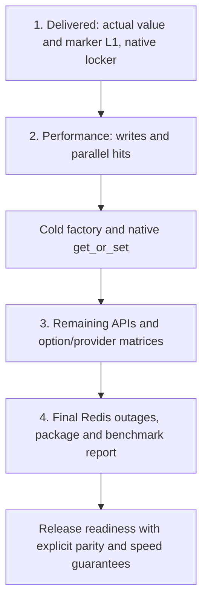

# Amalgam roadmap — 2026-10-06

Delivered implementation: main `7ee0308`,663 all-feature runtime tests and
140 independent full-feature archive checks. Exact CI is tracked separately;
its bounded layer-event consumer test is being repaired.
FusionCache reference is pinned released2.9. Registry0.3.1 remains unchanged.
This plan orders the remaining work; it is not a claim of completed parity.

| Order | Work | Completion evidence |
|---|---|---|
| 1 — delivered | Actual external tag/clear L1: shared local/durable observations, namespaces, original failures, atomic races and owned native/async work | Independent contracts, full pinned/current-toolchain gates, actual package Redis/OTLP checks and exact-source before/after measurements; then deliver verified main |
| 2 — next/current performance | Profile and improve writes and parallel public hits first; then cold factory and sync get_or_set | Same payload/options/semantics, alternating repeated before/after runs against actual released FusionCache; report ranges, allocations and remaining slow operations |
| 3 — remaining functionality | Typed heterogeneous values/registry; runtime component/default replacement; event scheduling/fault policy; trace/log options; supported automatic recovery and portable atomic tag/clear; complete native/provider/options evidence | Close explicit items in FULL_CONTRACT with working public contracts and reference comparisons; retain deliberate differences explicitly |
| 4 — release readiness | Repeat outage/recovery and cross-node checks, package consumer and final benchmark report; document migration and supported guarantees | Verified archive, exact-source green CI, release notes and a complete capability/speed table |

Current performance priority uses five fresh triples for7ee0308: replacement3.56×,
same-key8-thread2.81×,distinct-key8-thread4.61×,cold factory1.67× and native
get_or_set1.17× FusionCache time. Replacement is4–5% faster than preceding main. Async scalar reads are already faster. These
are defined workloads, not a universal claim. L2 in this suite is in-memory JSON.

Each completed block is visible in the main checkout. Keep one shared build
cache with the existing5GiB cleanup guard; do not accumulate new targets or
Docker images. Deliver each verified block with its own checks and measurements.
The goal is equal or better supported behavior and speed; Rust alone is not the
completion criterion. See FULL_CONTRACT for the still-open capability inventory.

The current CI repair consumes the bounded event stream during every convergence
probe and still requires both value absence and the physical Remove event without
lag. It changes test scheduling only; implementation hashes remain those measured
for7ee0308. No registry release is implied by main delivery.
